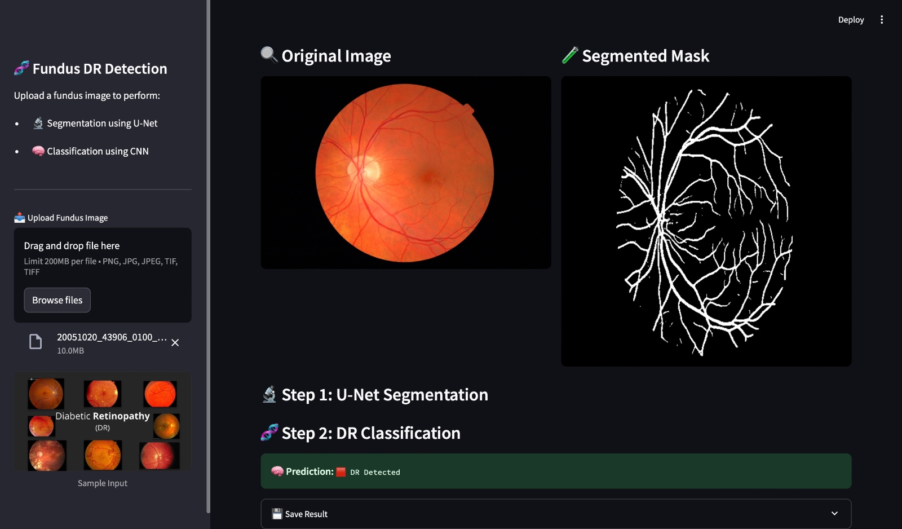

# SegClassNet

**A U-Net-Based Deep Learning Framework for Retinal Vessel Segmentation and Early-Stage Diabetic Retinopathy Classification**

SegClassNet is a deep learning system that performs **retinal vessel segmentation** and **early-stage diabetic retinopathy (DR) classification** in a single pipeline. Designed with a U-Net-based architecture and attention mechanisms, it supports robust clinical insights from fundus images.

---

## 📚 Table of Contents

- [🔍 Overview](#-overview)
- [🧠 Model Architecture](#-model-architecture)
- [🗃️ Datasets](#️-datasets)
- [⚙️ Setup](#-setup)
- [🚀 Usage](#-usage)
- [🧪 Results](#-results)
- [📓 Jupyter Notebooks](#-jupyter-notebooks)
- [👥 Contributors](#-contributors)
- [📄 License](#-license)
- [📌 Citation](#-citation)
---
jyoti singh


## 🔍 Overview

- **Segmentation Module**: Extracts retinal blood vessels from fundus images.
- **Classification Module**: Predicts diabetic retinopathy (DR) stages (especially early onset).
- **Backbone**: U-Net with custom encoder-decoder blocks and spatial attention.
- **Applications**: Early detection of DR, tele-ophthalmology, medical image analysis.

---

## 🧠 Model Architecture

The architecture consists of two main stages: **segmentation** and **classification**. A U-Net is used for vessel segmentation, followed by a CNN-based classification module for diabetic retinopathy detection.


---

## 🗃️ Datasets

You can download the datasets from Kaggle:

- 🔗 [RetinoMix-5 (ParikshaKaur)](https://www.kaggle.com/datasets/parikshakaur/retinomix-5)  
- 🔗 [MESSIDOR (ParikshaKaur)](https://www.kaggle.com/datasets/parikshakaur/messidor)

> After downloading, place the datasets under:  
> `./data/retinomix_5/` and `./data/messidor/`

---

## ⚙️ Setup

Follow the steps to prepare the environment and data for running the notebooks.

### 1. Clone the Repository

Clone the project to your local machine:

```bash
git clone https://github.com/prachimishra1/Retinal-Vessel-Segmentation-and-Early-Stage-Diabetic-Retinopathy-Classification.git
cd Retinal-Vessel-Segmentation-and-Early-Stage-Diabetic-Retinopathy-Classification
```
### 2. Install Dependencies

Install all required Python packages using the provided `requirements.txt` file:

```bash
pip install -r requirements.txt
```
  💡 Using Jupyter Notebook or Google Colab?
Add the following line at the top of your notebook:
```bash
 !pip install -r requirements.txt
```
### 3. Download and Organize Datasets

Download the following datasets from Kaggle:

- 🔗 [RetinoMix‑5](https://www.kaggle.com/datasets/parikshakaur/retinomix-5)
- 🔗 [MESSIDOR](https://www.kaggle.com/datasets/parikshakaur/messidor)

After downloading, organize them into the following directory `data/` structure:
```
data/
├── retinomix_5/
│ ├── images/
│ └── masks/
└── messidor/
├── images/
└── labels.csv
```
> Make sure the folder names and structure match exactly to avoid file path errors during training or inference.

---

### 4. Run the Notebooks

Navigate to the `notebooks/` directory and open the Jupyter notebooks:

- `Segmentation_Training.ipynb` — Train the segmentation model  
- `Classification_Training.ipynb` — Train the DR classification model  
- `Interface_Demo.py` — Run end-to-end prediction on a new image

You can run these using:

- Jupyter Notebook locally  
- Google Colab (recommended for limited hardware)

> 📌 Make sure dependencies are installed and datasets are prepared before running the notebooks.

---

 ## 🚀 Usage

All training, evaluation, and inference steps can be run directly from the provided Jupyter notebooks.

### 🧠 Notebooks Provided

- `Segmentation_Training.ipynb` – Train U-Net model for retinal vessel segmentation  
- `Classification_Training.ipynb` – Train CNN model for DR classification  
- `Interface_Demo.py` – Run full pipeline on new fundus images

### 📌 How to Use

1. Open any `.ipynb`,`.py` file using Jupyter Notebook or Google Colab.
2. Follow the step-by-step instructions in each notebook cell.
3. Modify parameters (e.g., dataset path, number of epochs) as needed.

> Make sure the datasets are downloaded and placed in the `./data/` folder before running notebooks.

## 🧪 Results

SegClassNet was evaluated on both segmentation and classification tasks using the RetinoMix-5 and MESSIDOR datasets. Below are the core metrics and visual outputs:

### 📊 Quantitative Results

| Task              | Metric           | Score     |
|-------------------|------------------|-----------|
| Segmentation      | Dice Score       | 0.87      |
|                   | SSIM             | 0.92      |
| Classification    | Accuracy         | 99.3%     |
|                   | Precision-Recall AUC | 0.99 |

---

### 🖼️ Visual Outputs

#### ✅ Retinal Vessel Segmentation

Shows the original fundus image and its predicted vessel mask.


#### ✅ DR Classification Output

Displays prediction for early-stage diabetic retinopathy (e.g., *Abnormal* or *Normal*).


#### 🧑‍💻 UI Demo Screenshot

Illustrates the interactive UI allowing image upload and real-time output.



## 👥 Contributors

- [Prachi Mishra](https://github.com/prachimishra1)
- [Jyoti Singh](https://github.com/Jyoti2024)
- [Abhishek Pandey](https://github.com/EveryAbhi00)

---
## 📄 License

This project is licensed under the [MIT License](LICENSE).

---

## 📌 Citation

If you use this work in your research, please cite it as:

```bibtex
@article{prachimishra2025segclassnet,
  title={SegClassNet: A U-Net-Based Deep Learning Framework for Retinal Vessel Segmentation and Early-Stage Diabetic Retinopathy Classification},
  author={Mishra, Prachi and Others},
  journal={GitHub Repository},
  year={2025},
  howpublished={\url{https://github.com/prachimishra1/Retinal-Vessel-Segmentation-and-Early-Stage-Diabetic-Retinopathy-Classification}}
}
